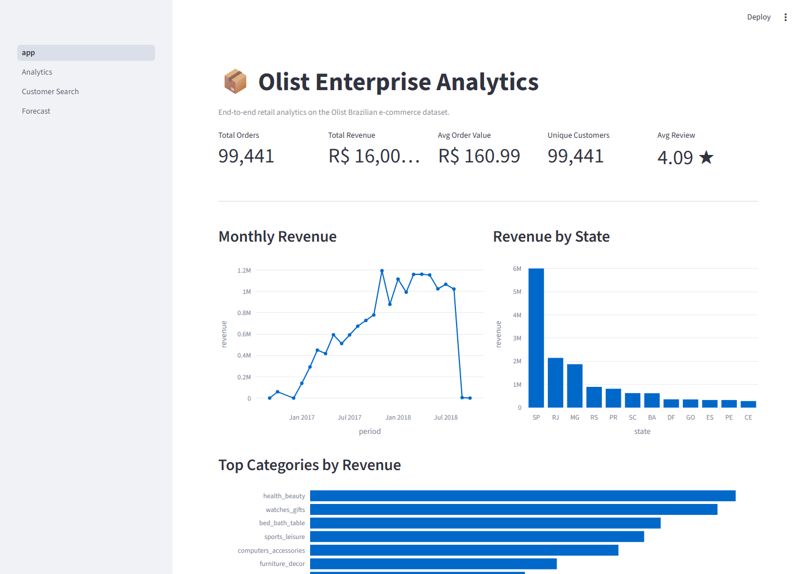
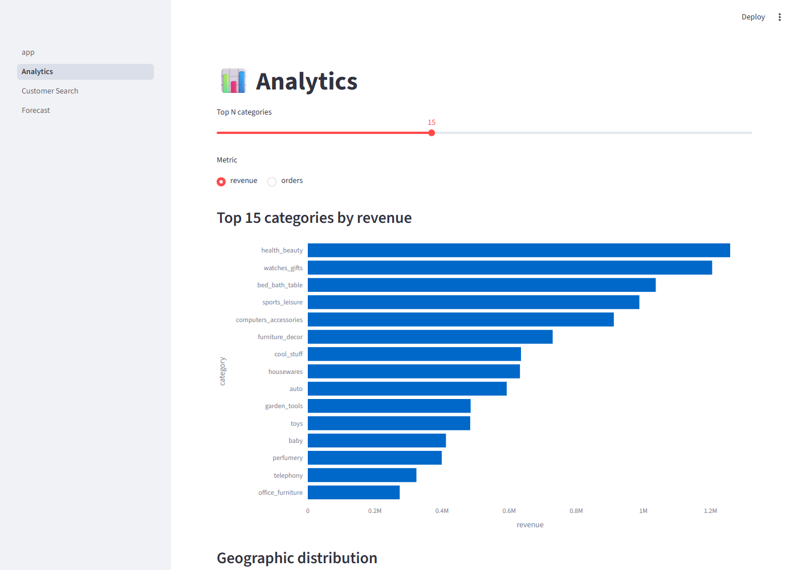
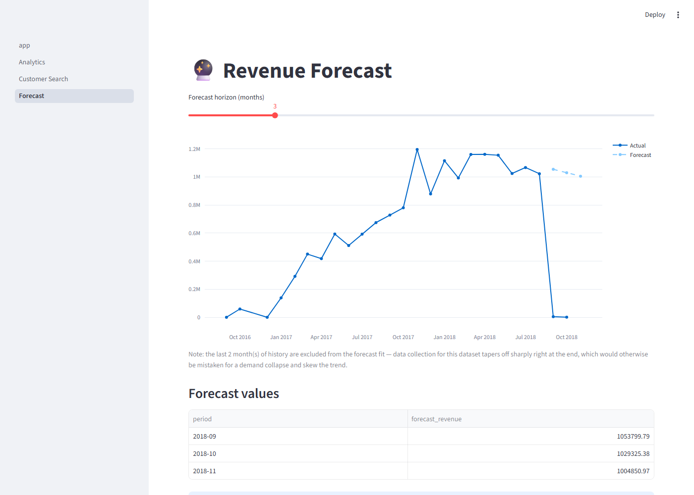
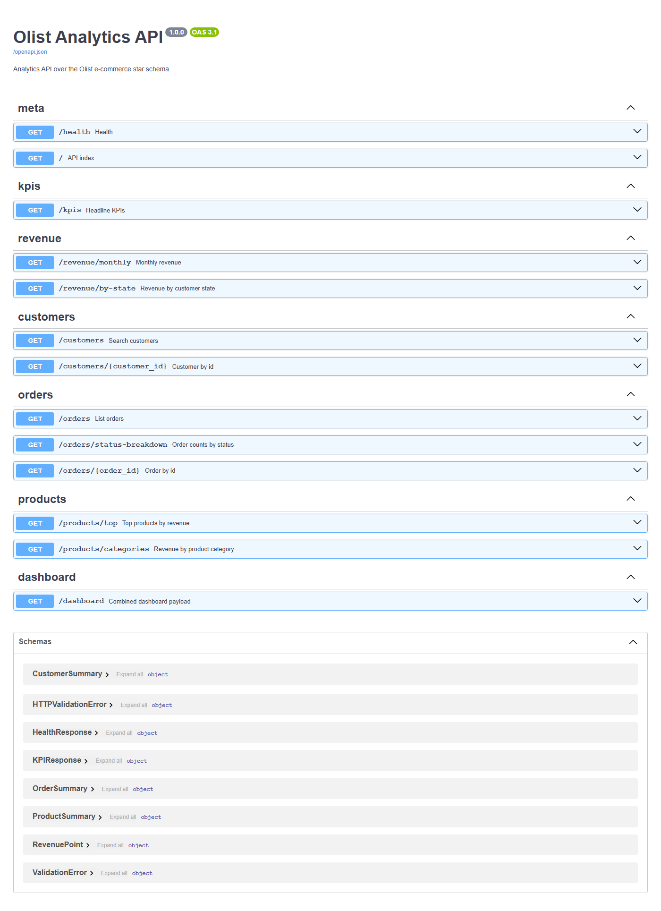
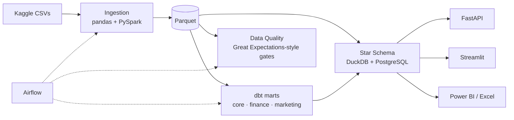

# 🏢 Enterprise Retail Analytics Platform


An end-to-end, production-style analytics platform built on the
[Olist Brazilian E-Commerce dataset](https://www.kaggle.com/datasets/olistbr/brazilian-ecommerce)
(~100k orders, 2016–2018): ingestion → Spark transforms → star-schema
warehouse → dbt marts → data-quality gates → Airflow orchestration → REST API →
Streamlit dashboard → Power BI/Excel, all containerised and CI-tested.

---

## 🎯 The business problem

Olist is a Brazilian marketplace connecting small sellers to large channels.
Leadership needs answers that raw operational CSVs can't give directly:

- **Revenue**: How is GMV trending? Which states and categories drive it?
- **Customers**: Who are our champions? What's retention by acquisition cohort?
- **Operations**: Are we delivering on time? Where is freight eating margin?
- **Experience**: Do late deliveries hurt review scores and repeat purchases?

This platform turns the nine raw files into a governed star schema and serves
those answers through SQL, an API, dashboards and BI tools — with data-quality
gates so a bad load never reaches a report.

## 📸 Screenshots

| Streamlit — Overview | Streamlit — Analytics | Streamlit — Forecast |
|---|---|---|
|  |  |  |



## 🏗 Architecture



Full diagrams: [docs/architecture.md](docs/architecture.md) ·
[docs/er_diagram.md](docs/er_diagram.md)

## 📂 Repository layout

```
├── src/eap/              # Installable Python package (the platform core)
│   ├── config/           #   typed settings + dataset catalog (single schema truth)
│   ├── ingestion/        #   Kaggle download + pandas cleaning
│   ├── quality/          #   validation engine + GE suites
│   ├── warehouse/        #   DuckDB star-schema builder
│   └── cli.py            #   `eap` CLI (ingest / spark / warehouse / quality / pipeline)
├── spark_jobs/           # PySpark: CSV→Parquet + broadcast-join transforms
├── sql/                  # DDL, indexes, views, procedures + 87-query library
│   └── queries/          #   8 themed files, every query DuckDB+Postgres portable
├── dbt/olist/            # staging → intermediate → marts, tests, seeds, macros
├── airflow/dags/         # master pipeline + ingestion/quality/reporting DAGs
├── api/                  # FastAPI service over the warehouse
├── streamlit/            # Multi-page dashboard (overview/analytics/search/forecast/insights)
├── docker/               # Dockerfiles (api, streamlit, airflow)
├── tests/                # pytest unit + integration (25 tests)
├── docs/                 # architecture, ER, Power BI, Excel, API, Streamlit guides
└── .github/workflows/    # CI: ruff + black + mypy + pytest + dbt parse
```

## 🚀 Quickstart

```bash
git clone <this-repo> && cd Enterprise-Analytics-Platform

# 1. Environment
make setup            # venv + all extras + pre-commit
make env              # .env from template (add Kaggle creds, or drop the zip in data/raw)

# 2. Full local pipeline: download → ingest → spark → warehouse → dbt → quality
make pipeline

# 3. Serve
make api              # http://localhost:8000/docs
make app              # http://localhost:8501

# Or run the whole stack in Docker (postgres + api + streamlit + airflow + mlflow)
make up
```

No Kaggle account? Place the dataset zip in `data/raw/` — the downloader
falls back to local extraction automatically.

## 📚 The SQL library (87 queries)

`sql/queries/` is an interview-grade library where every query states the
business question it answers and runs unchanged on DuckDB **and** PostgreSQL:

| File | Topics | Queries |
|---|---|---|
| `01_basics_and_aggregation` | KPIs, GROUP BY, HAVING, conditional agg | Q1–Q12 |
| `02_window_functions` | running totals, LAG/LEAD, moving avg, NTILE, PERCENT_RANK | Q13–Q27 |
| `03_ctes_and_recursive` | multi-CTE pipelines, recursive date spines, gap filling | Q28–Q37 |
| `04_ranking_and_topn` | greatest-n-per-group, Pareto, leaderboards | Q38–Q47 |
| `05_cohort_and_retention` | acquisition cohorts, M1 retention, churn proxy | Q48–Q57 |
| `06_rfm_and_segmentation` | RFM scoring, named segments, cross-sell affinity | Q58–Q66 |
| `07_abc_rolling_and_advanced` | ABC classes, rolling windows, pivots, funnels | Q67–Q78 |
| `08_insights` | actionable insights: delivery-retention impact, freight profitability, RFM win-back list, cohort payback, geographic opportunity — each commented with the business question **and** the decision it informs | Q79–Q87 |

Plus `sql/ddl/` (schema, indexes, views), `sql/dml/` (in-database load) and
`sql/procedures/` (functions, a materialised-snapshot procedure, an audit
trigger, a transactional cancel procedure).

## ✅ What's tested

- **25 pytest tests** (unit + integration) covering the catalog, ingestion
  cleaning/dedup, quality checks (including injected FK violations), the star
  schema build, and every API endpoint against a real DuckDB warehouse.
- **Full local pipeline run against the real ~100k-order Kaggle dataset**:
  `eap ingest run` (all 9 CSVs), `eap spark run-all` (all 9 partitioned Parquet
  tables plus `fact_orders_enriched`), `eap warehouse build`, and
  `eap quality validate` (41/41 checks pass; known duplicate `review_id`s are
  removed during ingestion dedup before validation runs).
- **Full Docker Compose stack verified end-to-end**: `postgres` (schema +
  tables applied from `sql/ddl` on init), `api` (`/health` reports
  `warehouse_available: true`), `streamlit` (renders), `scripts/load_postgres.py`
  (Postgres row counts match DuckDB exactly across all 9 star-schema tables),
  and `airflow` (all 4 DAGs — `olist_ingestion`, `olist_pipeline`,
  `olist_data_quality`, `olist_reporting` — parse with zero import errors,
  confirmed via `airflow dags list-import-errors`).
- PySpark runs inside a Linux container rather than natively on Windows — see
  [docs/architecture.md](docs/architecture.md) or the `spark_jobs/` notes if
  reproducing on Windows; native execution hits a JDK 25 incompatibility and
  the lack of an official Windows `winutils.exe` distribution.
- **18 dbt data tests** (unique/not-null/relationships/accepted-values) plus a
  singular revenue test, run against the real warehouse with
  `DBT_PROFILES_DIR=. dbt build --target duckdb` from `dbt/olist` —
  `PASS=37 ERROR=0` (1 seed, 8 table models, 10 views, 18 tests).
- **All 87 SQL queries in `sql/queries/`** executed against the real DuckDB
  warehouse (`python scripts/run_sql_library.py`) — 87/87 pass, 0 return zero
  rows.
- **Insights page** (`streamlit/pages/4_Insights.py`) — 5 actionable
  recommendations (delivery-retention impact, freight profitability, RFM
  win-back list, cohort payback, geographic opportunity), each computed live
  from the real warehouse and verified rendering end-to-end via a headless
  browser.
- **CI** runs ruff, black, mypy, pytest with coverage, and `dbt parse` on
  every push. *(Runs on push; not re-executed locally in this pass — the
  pytest suite, dbt build and SQL library above are the parts that were
  re-verified here.)*

## 📊 Dashboards & BI

- **Streamlit** — KPI overview, category analytics, customer search with CSV
  export, a Holt-Winters revenue forecast, and an actionable insights page
  with quantified recommendations. [Guide](docs/streamlit.md)
- **FastAPI** — 12 endpoints with typed schemas and Swagger docs. [Guide](docs/api.md)
- **Power BI** — connection steps, relationship model and a DAX measure pack. [Guide](docs/powerbi.md)
- **Excel** — Power Query over Parquet + pivot starter pack. [Guide](docs/excel.md)

## 🧠 Key design decisions

1. **One schema catalog** (`src/eap/config/catalog.py`) drives pandas
   ingestion, Spark jobs, quality checks and the warehouse — change a column
   in one place.
2. **Dual warehouse, identical tables**: DuckDB for zero-infra local analytics
   and tests; PostgreSQL for the enterprise stack — so every SQL asset is
   portable between them.
3. **Thin Airflow DAGs** that call the tested `eap` CLI; orchestration and
   logic never mix.
4. **Quality as a gate**: validation exits non-zero and stops the pipeline
   before bad data reaches marts or dashboards.

## 📄 Resume bullets this project supports

- Built an end-to-end ELT platform (Python 3.12, PySpark, dbt, Airflow,
  PostgreSQL/DuckDB) processing the 100k-order Olist dataset into a tested
  star schema with automated data-quality gates.
- Designed a dimensional model (5 dimensions, 4 facts) and authored an
  87-query analytical SQL library covering window functions, recursive CTEs,
  cohort retention, RFM segmentation, ABC analysis and decision-oriented
  business insights, portable across DuckDB and PostgreSQL.
- Shipped a FastAPI analytics service and a multi-page Streamlit dashboard
  over the warehouse, containerised the full stack with Docker Compose, and
  enforced quality with 25 pytest tests, 18 dbt tests and a GitHub Actions
  CI pipeline (ruff, black, mypy, pytest, dbt parse).

## 🔮 Future improvements

- Delta Lake tables + incremental Spark loads
- MLflow-tracked demand-forecasting and review-sentiment models
- dbt exposures + docs site published from CI
- Kubernetes deployment (Helm) with Airflow KubernetesExecutor
- dbt incremental models & snapshots for slowly changing dimensions

## 📜 License

MIT — see [LICENSE](LICENSE).
