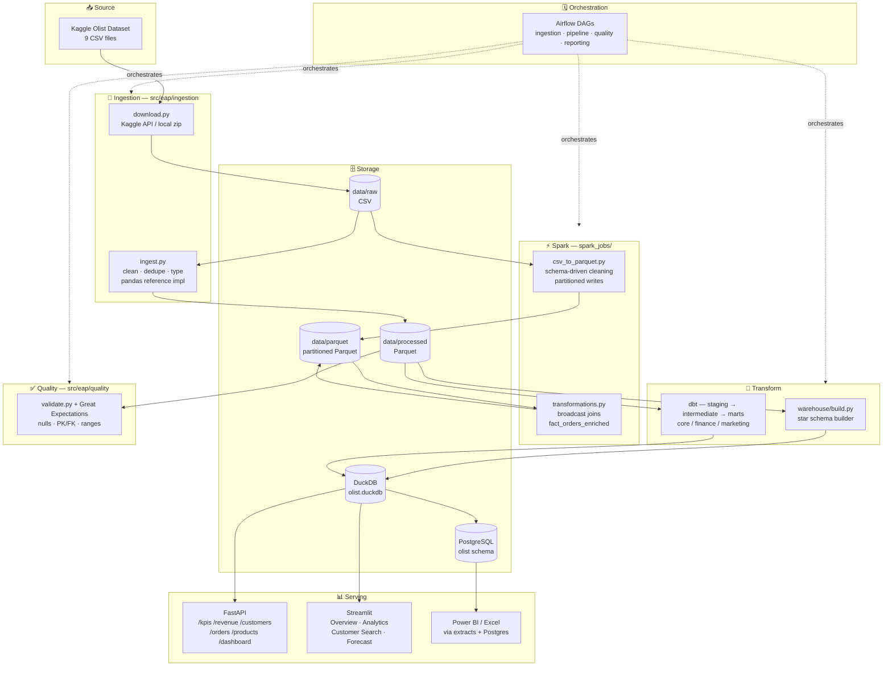

# Architecture

The platform is a layered ELT system: acquire → clean → transform → model → serve.
Every layer is independently runnable and tested; the whole flow is orchestrated
by Airflow and reproducible with `make pipeline`.

## System diagram

## Layer responsibilities

| Layer | Code | Contract |
|---|---|---|
| Acquisition | `eap.ingestion.download` | Raw CSVs exist in `data/raw`; idempotent |
| Cleaning | `eap.ingestion.ingest` (pandas), `spark_jobs/csv_to_parquet` (Spark) | Typed, deduplicated Parquet; both driven by the same `catalog.py` |
| Modelling | `eap.warehouse.build` (deterministic baseline), `dbt/olist` (marts + tests) | Identical star-schema table names in DuckDB and Postgres |
| Quality | `eap.quality` | Fails the pipeline on null/PK/FK/range regressions |
| Orchestration | `airflow/dags` | Thin DAGs; logic stays in the tested package |
| Serving | `api/`, `streamlit/` | Read-only consumers of the warehouse |

## Key design decisions

1. **Single source of schema truth.** `src/eap/config/catalog.py` declares every
   table's keys, timestamps and numeric columns. Ingestion (pandas *and*
   Spark), validation and the warehouse builder all read it — schema knowledge
   lives in exactly one place.
2. **Dual warehouse, one schema.** DuckDB gives a zero-infrastructure local
   OLAP engine for the API, Streamlit and tests; Postgres is the "enterprise"
   target with full DDL, indexes, views and procedures. Table names are
   identical, so the 78-query SQL library runs on both.
3. **Thin orchestration.** Airflow tasks call the `eap` CLI / package. DAG
   files contain no business logic, which keeps them testable and diff-able.
4. **Quality as a gate, not a report.** `eap quality validate` exits non-zero
   on failure, so both `make pipeline` and the Airflow DAG stop before bad
   data reaches marts.

## ER diagram

See [er_diagram.md](er_diagram.md).
