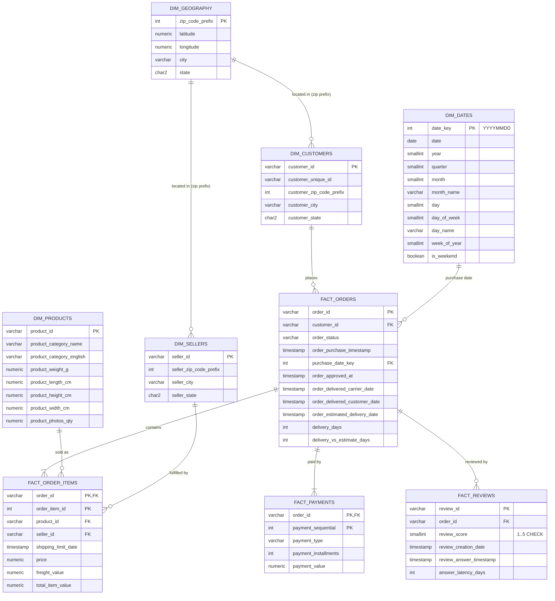

# Star Schema — ER Diagram

The warehouse models Olist as a classic star schema: conformed dimensions
around four fact tables at different grains.

## Grain of each fact

| Fact | Grain | Typical questions |
|---|---|---|
| `fact_orders` | one row per order | delivery SLAs, status funnels, order counts |
| `fact_order_items` | one row per order line | product & seller revenue, freight economics |
| `fact_payments` | one row per payment attempt | payment mix, installments, revenue |
| `fact_reviews` | one row per review | CSAT, review latency, score drivers |

Physical DDL: [`sql/ddl/01_schema.sql`](../sql/ddl/01_schema.sql) (PostgreSQL) and
the embedded DDL in [`src/eap/warehouse/build.py`](../src/eap/warehouse/build.py) (DuckDB).
